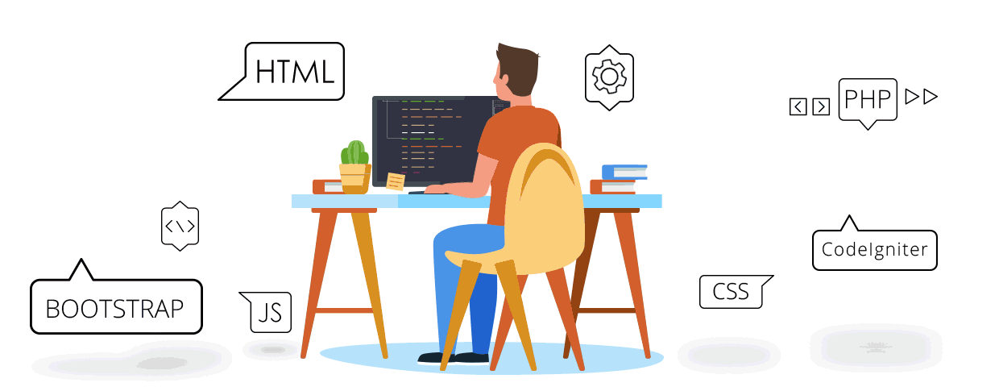

<h1 style="color:#F2F2F2">Welcome to my Github space!</h1>

<h3 style="color:#237BFF">I'm Sonu kumar Yadav, React Native & Full stack developer from Uttar Pradesh, India.</h3>

As a fresh React Native developer, I'm excited to dive headfirst into the world of mobile app development. I may be new to this field, but don't let that fool you - I'm armed with the latest coding techniques and a passion for creating applications that will knock your socks off. 

With React Native, I can build apps that run on both iOS and Android platforms, which means I get to be a superhero without the cape. From designing sleek UIs to integrating APIs, I am eager to flex my coding muscles and create something truly unique. 

I am always on the lookout for opportunities to collaborate and learn from others. After all, coding is a team sport, and I'm ready to be a team player. So let's work together to build something awesome and leave a lasting mark on the world of mobile app development.  

<h1 style="color:#F2F2F2;margin-top:15px">Important Links</h1>

<a href="https://sonukr.in/" target="_blank" rel="noopener noreferrer" style="font-size:20px;font-weight:700;background-color:#000000; padding:10px;"> 📱 PORTFOLIO</a>
|
<a href="https://drive.google.com/file/d/122KRQEnSWFU3YnfyHmoRQzkeEqHuQ3b0/view?usp=share_link" target="_blank" rel="noopener noreferrer"
style="font-size:20px;font-weight:700; background-color:#000000; padding:10px" >📃 RESUME  </a>

<h1 style="color:#F2F2F2; margin-top:15px">Socials</h1>

<h1 style="color:#F2F2F2; margin-top:25px">Email </h1>
<h2>

**sonukryadav56@gmail.com**
</h2>

<h1 style="color:#F2F2F2; margin-top:35px">Tech stack that I know  </h1>

</>

<h2>Stats 📊  </h2>

<!--  -->

<!--  -->

<h2>GitHub Stat Trophies</h2>

<h2>Streak Stats  </h2>
  
  
  <!--  -->
  

  <h2>Certifications: </h2>
  
🚀. <a href="https://www.freecodecamp.org/certification/fcc55e67c3e-f191-4c28-83fc-2e20e45f2bd4/back-end-development-and-apis" target="_blank" rel="noopener noreferrer">Back End Development and APIs</a>

🚀. <a href="https://drive.google.com/file/d/1vggmy9jYK9VDdUA_1_on7Qy2xwf9ZfqL/view" target="_blank" rel="noopener noreferrer">Programming in Java</a>

