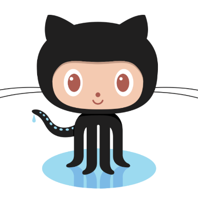

<h1>Hi 🖐️ there! Good to see you. </h1>

<h2>Welcome to my Github space!</h2>
<h3>I'm Sonu kumar Yadav, Full stack developer from Uttar Pradesh, India.</h3>

Result - driven web developer with
business objective. Detail - oriented
when crafting responsive website,
and apps to propel competitive
advantage in the market. Technically
proficient and problem solver with a
focused attitude. 
If I need to define myself in one sentence that would be a curious young person, ready to start a career in the IT field, a good observer, an enthusiast, and tech-obsessed!!! 
Looking forward to connect with you.

➡️ <a href="https://drive.google.com/file/d/122KRQEnSWFU3YnfyHmoRQzkeEqHuQ3b0/view?usp=share_link" target="_blank" rel="noopener noreferrer">RESUME 📃</a>↔
<a href="https://sonukr.in/" target="_blank" rel="noopener noreferrer">PORTFOLIO 🖥️</a>

<h2>Socials</h2>

<h2>Email :</h2>

**sonukryadav56@gmail.com**

<h2>Tech stack that I know  </h2>

<h2>Stats 📊  </h2>

<!--  -->

<!--  -->

<h2>GitHub Stat Trophies</h2>

<h2>Streak Stats  </h2>
  
  
  <!--  -->
  

  <h2>Certifications: </h2>
  
🚀. <a href="https://www.freecodecamp.org/certification/fcc55e67c3e-f191-4c28-83fc-2e20e45f2bd4/back-end-development-and-apis" target="_blank" rel="noopener noreferrer">Back End Development and APIs</a>

🚀. <a href="https://drive.google.com/file/d/1vggmy9jYK9VDdUA_1_on7Qy2xwf9ZfqL/view" target="_blank" rel="noopener noreferrer">Programming in Java</a>

