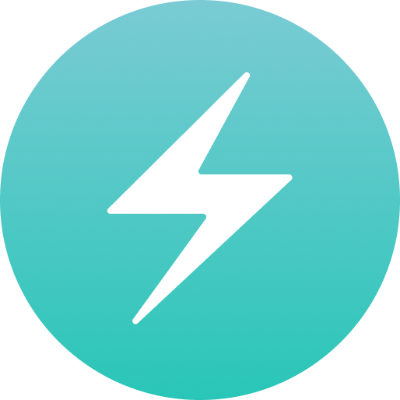

<h1>Hi 🖐️ there! Good to see you. </h1>

<h2>Welcome to my Github space!</h2>
<h3>I'm Sonu kumar Yadav, Full stack developer from Uttar Pradesh, India.</h3>

➡️ <a href="https://drive.google.com/file/d/1rNt7Y5VTeFUusZLMg9hOUQGh_wYduH79/view?usp=share_link">RESUME 📃</a>↔
<a href="https://sonukr.in/">PORTFOLIO 🖥️</a>

<h3>Socials</h3>

<h3>Email : sonukryadav56@gmail.com</h3>

<h3>Tech stack that I know : </h3>

<h3>Stats 📊 : </h3>

<h3>GitHub Stat Trophies</h3>

<h3>Streak Stats : </h3>
  
  
  

